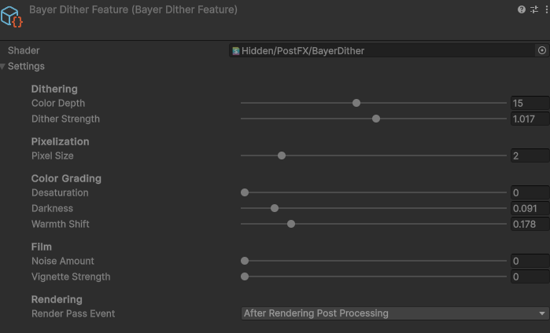

# Bayer Dither Post-Process for URP

Single-pass URP post-process: 4×4 Bayer dithering, color quantization, pixelization, warmth shift, desaturation, film grain, vignette.


## Install

**Window → Package Manager → + → Install package from git URL…**

```
https://github.com/Zimennik/bayer-dither-urp.git
```

## Use

1. Open your URP **Renderer** asset (the `*-Renderer.asset`, not the Pipeline asset).
2. **Add Renderer Feature → Bayer Dither Feature**.
3. Tweak.



## Parameters

| Parameter | Range | |
|---|---|---|
| Color Depth | 2–32 | Levels per channel. Lower = more posterized. |
| Dither Strength | 0–2 | `0` = pure posterization, `1` = full dither. |
| Pixel Size | 1–8 | Resolution divisor. |
| Desaturation | 0–1 | Toward BT.601 grayscale. |
| Darkness | 0–0.8 | Multiplies output by `(1 - darkness)`. |
| Warmth Shift | 0–1 | Push red, cut blue. Sepia-like. |
| Noise Amount | 0–0.15 | Animated film grain. |
| Vignette Strength | 0–2 | Radial darkening. |

## Compatibility

Unity 2022.3+ / URP 14+. Auto-uses RenderGraph on URP 17+, legacy `Execute` otherwise.

For builds: keep the `Hidden/PostFX/BayerDither` shader assigned in the feature inspector, or add it to **Project Settings → Graphics → Always Included Shaders**.

## License

[MIT](LICENSE.md)
